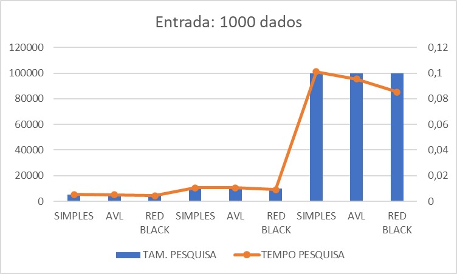
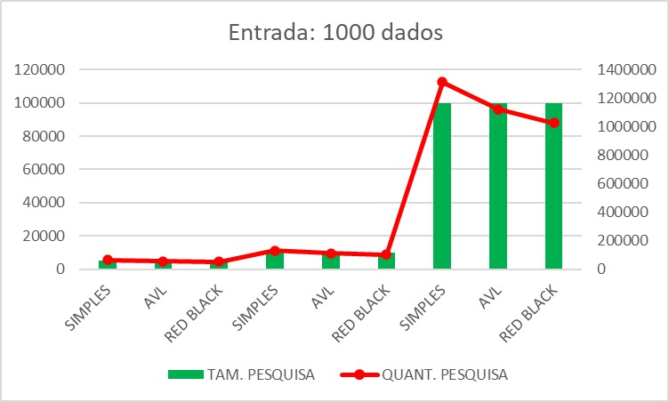
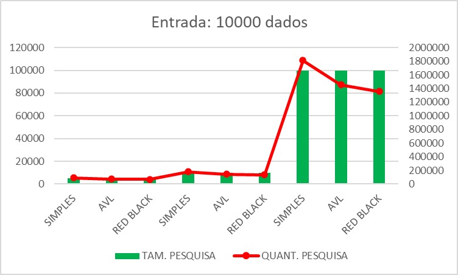
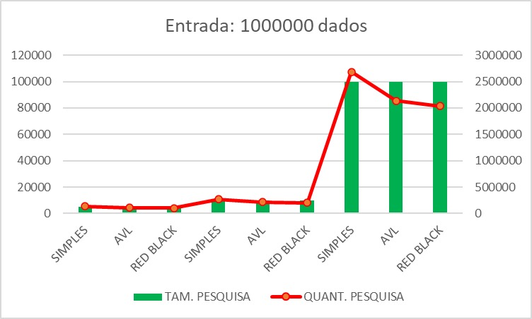
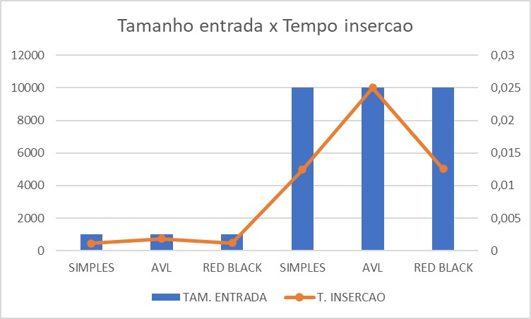
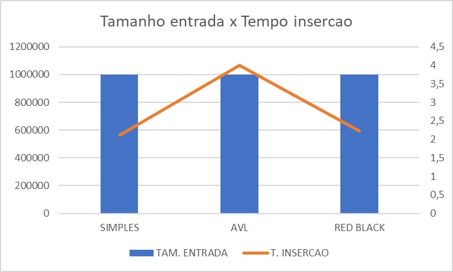

<h1 align="center"> Comparação das estruturas tipo árvore</h1>

Daniel Alves Sanches

Eng. Computação - 4º período - AEDS II

## Dados utilizados para analize

> Os tempos de pesquisa e insercao podem variavar

> A quantidade de pesquisa sera a mesma em qualquer maquina

    </img>
    </img>
    </img>
    </img>
    </img>
    </img>
    </img>
    </img>

