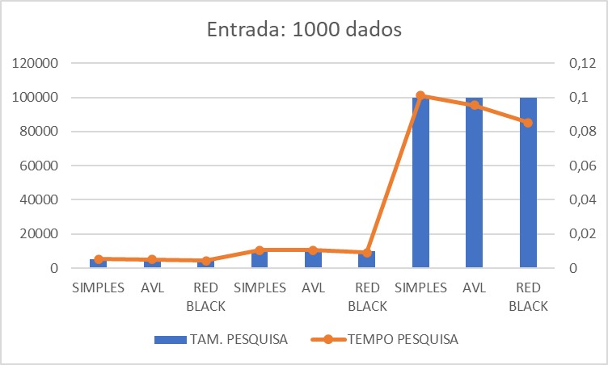
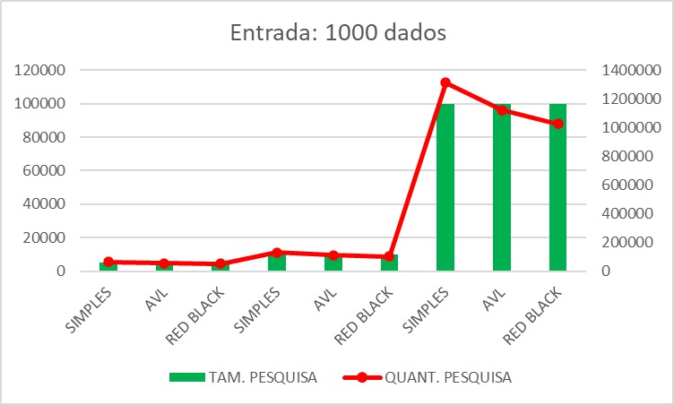
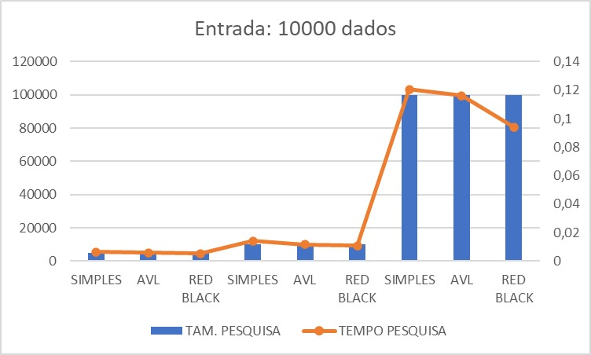
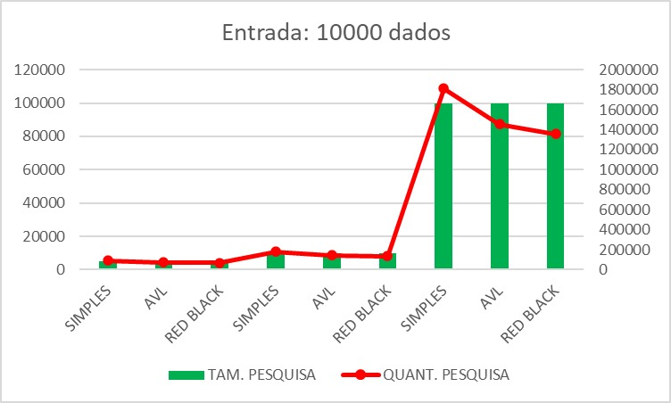
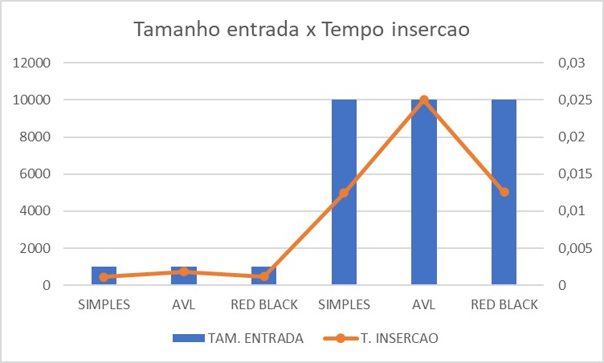
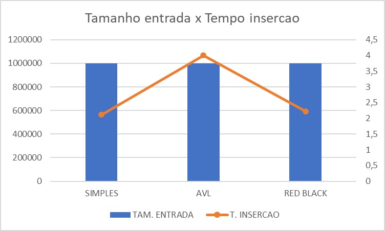

<h1 align="center"> Comparação das estruturas tipo árvore</h1>

Daniel Alves Sanches

Eng. Computação - 4º período - AEDS II

- A arvore Red Black e bem mais complexa para implementar, e para uma entrada de dados pequena ele tem um custo de pesquisa bem proximo da arvore simples e AVL, nao compensando utilizar para entradas pequenas

## Dados utilizados para analize

> Os tempos de pesquisa e insercao podem variavar em cada maquina

> A quantidade de pesquisa sera a mesma em qualquer maquina

    </img>
    </img>
    </img>
    </img>
    </img>
    </img>
    </img>
    </img>

### Tabela com os dados utilizados para a geracao dos graficos

|ARVORE|TAMANHO PESQUISA|TEMPO PESQUISA (s)|QUANTIDADE PESQUISA|TAMANHO ENTRADA|
|----|----|----|----|----|
Simples     |5000   |0,005353|65881|1000
AVL         |5000   |0,005170|56080|1000
Red Black   |5000   |0,004506|51190|1000
Simples     |10000  |0,010575|131054|1000
AVL         |10000  |0,010484|112184|1000
Red Black   |10000  |0,009176|102411|1000
Simples     |100000 |0,100983|1312248|1000
AVL         |100000 |0,095404|1122619|1000
Red Black   |100000 |0,085184|1025980|1000

ARVORE|TAMANHO PESQUISA|TEMPO PESQUISA (s)|QUANTIDADE PESQUISA|TAMANHO ENTRADA
|----|----|----|----|----|
Simples     |5000   |0,006292|90721|10000
AVL         |5000   |0,005825|72613|10000
Red Black   |5000   |0,005340|67726|10000
Simples     |10000  |0,014045|181474|10000
AVL         |10000  |0,011573|145378|10000
Red Black   |10000  |0,010877|135829|10000
Simples     |100000 |0,120410|1813343|10000
AVL         |100000 |0,116117|1454630|10000
Red Black   |100000 |0,094181|1358739|10000

|ARVORE|TAMANHO PESQUISA|TEMPO PESQUISA (s)|QUANTIDADE PESQUISA|TAMANHO ENTRADA|
|----|----|----|----|----|
Simples     |5000   |0,014582|133394|1000000
AVL         |5000   |0,012275|106245|1000000
Red Black   |5000   |0,010935|101358|1000000
Simples     |10000  |0,027925|267754|1000000
AVL         |10000  |0,022000|212643|1000000
Red Black   |10000  |0,020997|203079|1000000
Simples     |100000 |0,216585|2683614|1000000
AVL         |100000 |0,200959|2132835|1000000
Red Black   |100000 |0,180501|2035803|1000000

|ARVORE|TAMANHO ENTRADA|TEMPO INSERCAO (s)|
|----|----|----|
Simples     |1000   |0,001121
AVL         |1000   |0,001838
Red Black   |1000   |0,00118
Simples     |10000  |0,012425
AVL         |10000  |0,025016
Red Black   |10000  |0,012552
Simples     |1000000|2,116638
AVL         |1000000|4,007273
Red Black   |1000000|2,224072

### Referencias

- https://stackoverflow.com/questions/35117014/generating-a-random-uniformly-distributed-real-number-in-c

- http://linguagemc.com.br/arquivos-em-c-categoria-usando-arquivos/

- https://stackoverflow.com/questions/7462349/convert-double-value-to-a-char-array-in-c/18146858

- https://www.ic.unicamp.br/~francesquini/mc202/files/aula16-18.pdf

- https://stackoverflow.com/questions/10075294/converting-string-to-a-double-variable-in-c

- https://stackoverflow.com/questions/10797377/in-objective-c-what-utility-uses-brief-tag-in-comments

- https://developer.lsst.io/cpp/api-docs.html

- https://www.delftstack.com/pt/howto/c/how-to-convert-an-integer-to-a-string-in-c/

- https://qastack.com.br/programming/24383700/resize-image-in-the-wiki-of-github-using-markdown