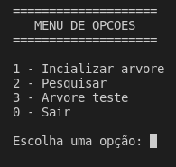
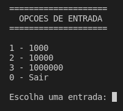
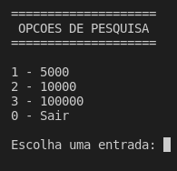
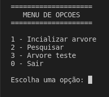
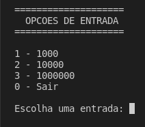
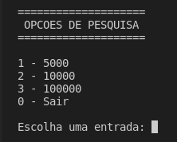

# comparacao-estrutura-arvore
Comparacao das estruturas tipo arvore

## Valores aleatorios

- Para gerar valores aleatorios utilize o metodo randomValue do arquivo file.c, sera gerado valores aleatorios para insercao das arvores. A quantidade de valore varia entre, 1000, 100000 e 1000000.

- Para a pesquisa sao gerados valores aleatorios entre 5000, 10000 e 100000 valores. Nos arquivos atuais de pesquisa foram modificados alguns destes valores para permitir a existencia de valores repetidos, validos e nao validos.

## Menu

<!-- 

 -->

- opcao 1

- opcao 2

- opcao 3
    - Insere os valores {11,2,14,1,7,15,5,8,4} nas tres arvores para teste, sendo possivel analizar as regras de cada uma.

- opcao 0
    - finaliza a aplicacao

## Informacoes

> S - Simples

> AVL - AVL

> RB - RedBlack